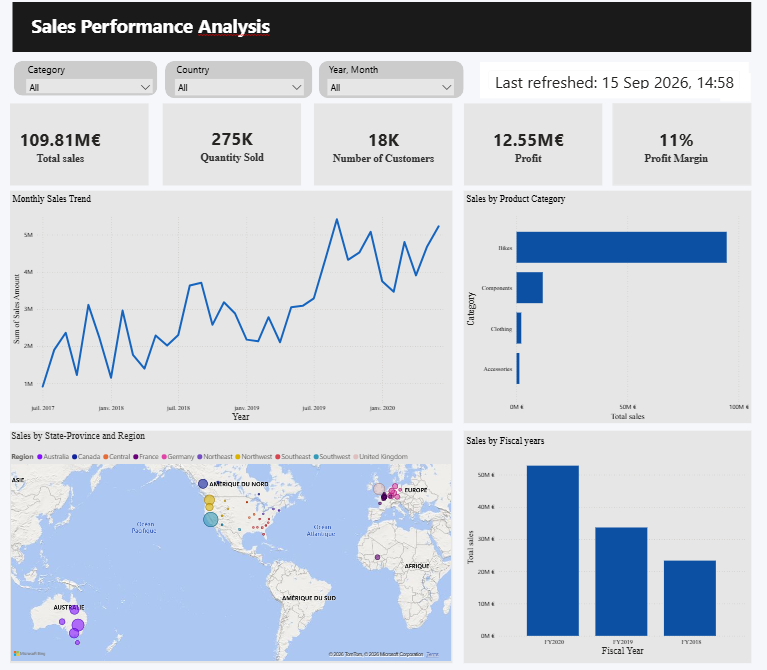
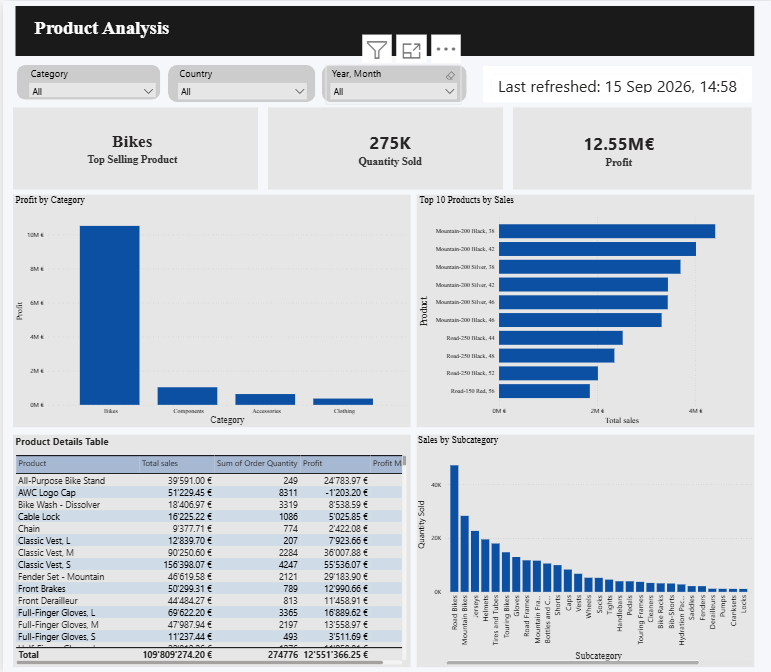
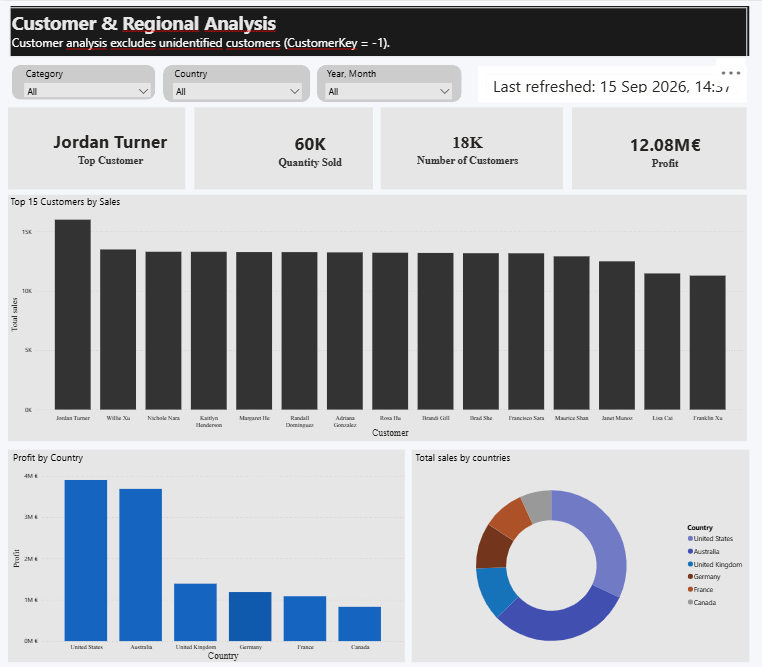

# adventureworks-powerbi
Sales analysis using Power BI and the AdventureWorks dataset
# Sales Performance Analysis – Power BI

## 📊 Project Overview

This project is an interactive sales analysis dashboard developed with Microsoft Power BI using the AdventureWorks Sales dataset.

The objective is to analyze sales performance from different perspectives, including overall performance, products, customers, and geographic regions.

## 🎯 Objectives

- Analyze overall sales performance
- Identify the best-selling products
- Analyze product categories and subcategories
- Identify top customers
- Analyze sales and profitability by country
- Explore sales trends over time
- Calculate key performance indicators (KPIs)

## 📁 Dashboard Pages

### 1. Sales Performance Analysis

Provides an overview of the company's sales performance through key KPIs and interactive visualizations.

Main indicators:
- Total Sales
- Quantity Sold
- Number of Customers
- Total Profit
- Profit Margin
- Sales evolution over time
- Sales by product category
- Sales by country/region

### 2. Product Analysis

Focuses on product performance and profitability.

Main analyses:
- Top Selling Product
- Top 10 Products by Sales
- Sales by Product Subcategory
- Profit by Product Category
- Product-level sales and profitability

### 3. Customer & Regional Analysis

Analyzes customer performance and geographical sales distribution.

Main analyses:
- Top Customer
- Top Customers by Sales
- Sales by Country
- Profit by Country
- Customer-level performance
- Geographic distribution of sales

> Note: Customer analysis excludes unidentified customers (`CustomerKey = -1`).

## 🛠️ Tools & Technologies

- Microsoft Power BI
- DAX
- Microsoft Excel
- Data Modeling
- Data Visualization
- Business Intelligence

## 📈 Key Skills Demonstrated

- Data cleaning and preparation
- Data modeling
- DAX measures
- KPI creation
- Interactive dashboard design
- Data analysis and visualization
- Business insights

## 📷 Dashboard Preview

### Sales Performance Analysis

### Product Analysis

### Customer & Regional Analysis

## 📂 Project Files

- `Sales_Performance_Analysis.pbix` – Power BI dashboard
- `Sales_Performance_Analysis.png` – Sales Performance Analysis page
- `Product_Analysis.png` – Product Analysis page
- `Customer_Regional_Analysis.png` – Customer & Regional Analysis page

## 📌 Dataset

The project uses the AdventureWorks Sales sample dataset.
